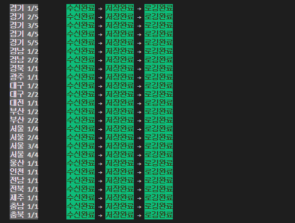

# 전기차 충전소 및 충전기 데이터 수집기 v3

## 📣 개요

[나만의 플러그 : myPlug](https://github.com/KGU-DCS-LAB/myPlug)의 전기차 충전소 데이터 수집기를 다시 제작한 프로젝트.

[v1](https://github.com/KGU-DCS-LAB/myPlug/tree/master/data-manager/legacy(java)/station-data-generator)는 Java로 작성된 데이터 수집기였고, [v2](https://github.com/KGU-DCS-LAB/myPlug/tree/master/data-manager)는 Node.js로 작성된 수집기였다면, v3은 v2를 기반으로 작성된 프로젝트 입니다. 

v2 개발 당시 Node.js에서 객체 처리만으로도 데이터 수집기가 온전하게 동작하고, 비동기 처리에 방점을 두었다면, v3에는 ES6의 클래스 기능을 적극 활용하여 훨씬 유지보수가 쉽게 작성되었다는 특징이 있습니다. 현재 상태를 표시하는 기능이 대폭 개선되었고, 데이터 수집 이력을 더욱 손쉽게 핸들링 할 수 있는 형태로 구조 개선이 이루어졌습니다. 특히 상태 관리에 관련된 모든 기능들이 StatusManager으로 이전되었습니다. 추후에 버전 관리가 가능한 형태로 개선이 된 상태입니다.

## ⚙️ 개발 환경

## ✅ 기능
    .
    ├── KECO로 부터 충전기 데이터 실시간 수신
    ├── KECO로 부터 수신 받은 데이터를 충전소와 충전기로 분리
    ├── 충전소와 충전기 데이터를 새 데이터로 overwrite (벌크형태로 저장/관리하여 속도 개선)
    ├── 충전기 사용 여부를 통계 데이터에 업데이트
    ├── 오래된 충전기 사용 통계는 자동 삭제
    └── 이 모든 과정을 주기적으로 자동 반복 처리

## ✨ Run Locally

Clone the project

    git clone https://github.com/gabrielyoon7/myplug-data.git

Go to the project directory

    cd myplug-data

Install dependencies

    npm install

Start the server

    npm start

## 🤷‍♂️ 실행하기 전에 ... 

1. Mongo DB를 설치하셨나요?
2. Node.js를 설치하셨나요?

